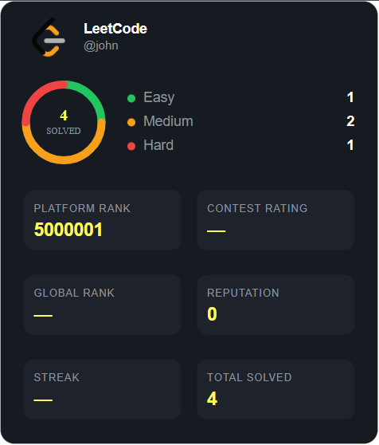
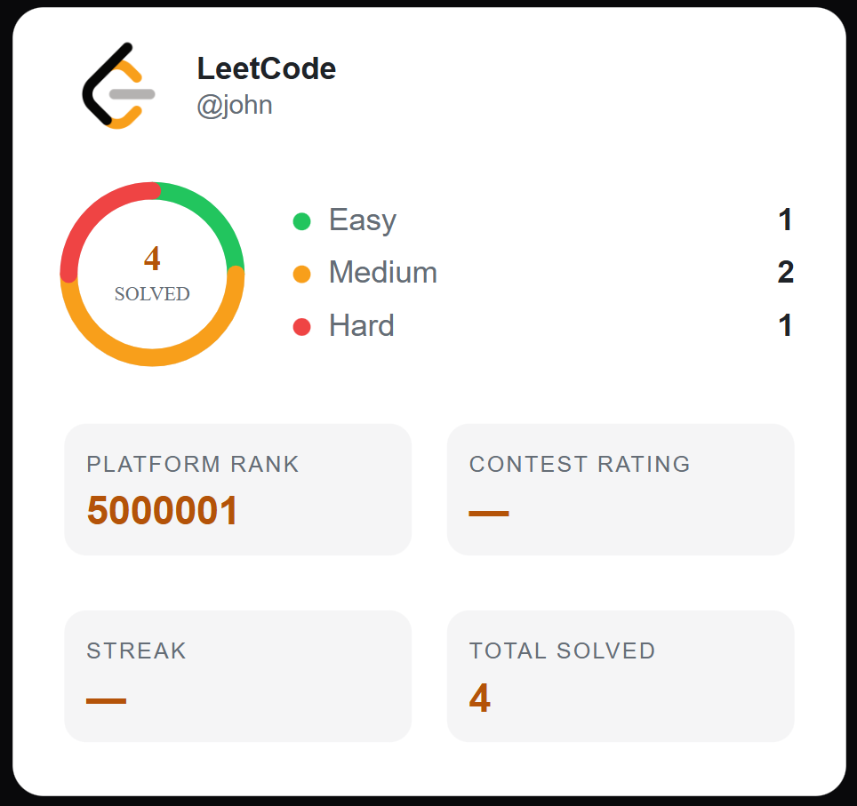
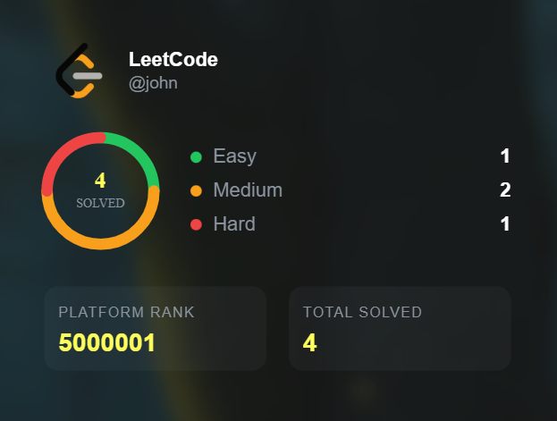
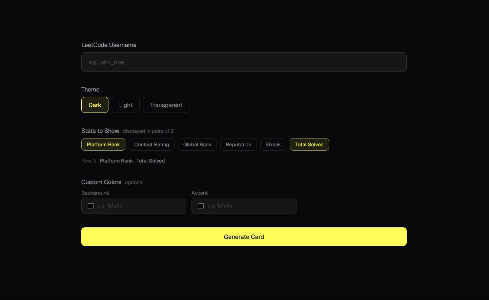

# leetcode-stats-card

Generate a beautiful, customizable LeetCode stats card for your GitHub README or portfolio — just like GitHub Readme Stats, but for LeetCode!



## 🚀 Usage

Add this to your GitHub README or any markdown file:

\`\`\`md
[](https://leetcode.com/YOUR_USERNAME)
\`\`\`

Or use it as an `` tag in your portfolio:

\`\`\`html

\`\`\`

---

## 🎨 Themes

### Dark (default)


### Light


### Transparent


\`\`\`md
[](https://leetcode.com/YOUR_USERNAME)
[](https://leetcode.com/YOUR_USERNAME)
[](https://leetcode.com/YOUR_USERNAME)
\`\`\`

---

## ⚙️ Parameters

| Parameter | Type | Default | Description |
|---|---|---|---|
| `username` | string | required | Your LeetCode username |
| `theme` | string | `dark` | Card theme: `dark`, `light`, `transparent` |
| `hide` | string | — | Hide specific stats, comma separated |
| `bg` | hex | — | Custom background color (without `#`) |
| `accent` | hex | — | Custom accent/value color (without `#`) |

---

## 📊 Stats Grid

You can choose which stats to display in the 2×2 grid using the `hide` parameter.

Available stats:

| Key | Description |
|---|---|
| `platformrank` | Your global LeetCode platform rank |
| `contestrating` | Your contest rating |
| `globalrank` | Your global contest rank |
| `reputation` | Your reputation points |
| `streak` | Your current streak |
| `totalsolved` | Total problems solved |

**Example — show only Platform Rank and Total Solved:**
\`\`\`md

\`\`\`

---

## 🎨 Custom Colors

You can fully customize the card colors using hex values (without `#`):

\`\`\`md

\`\`\`

---

## 🌐 Live Demo

Try the interactive card generator at:
**[leetcode-stats-card-opal.vercel.app](https://leetcode-stats-card-opal.vercel.app)**



---

## 🛠️ Tech Stack

- [Next.js](https://nextjs.org/) — framework
- [Vercel](https://vercel.com/) — hosting & edge functions
- LeetCode GraphQL API — data source
- Pure SVG — zero dependencies for card generation

---

## 🏃 Running Locally

```bash
git clone https://github.com/sheeeuWu/leetcode-stats-card.git
cd leetcode-stats-card
npm install
npm run dev
```

Open [http://localhost:3000](http://localhost:3000) to see the demo page.

The API will be available at:

```
http://localhost:3000/api/card?username=YOUR_USERNAME
```

---

## 📝 License

MIT © [saifaliCodes](https://github.com/sheeeuWu)
\`\`\`

---

